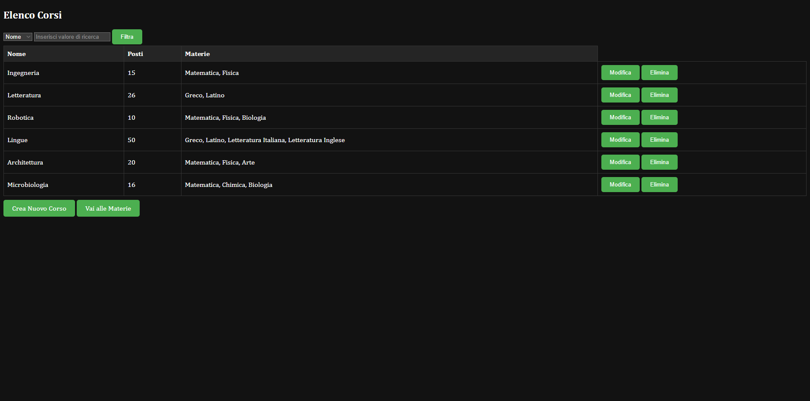
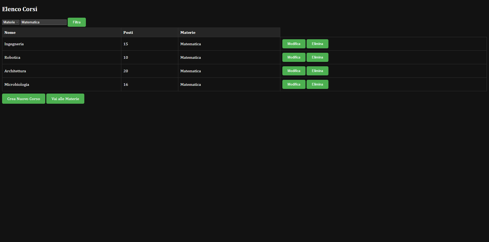

# API_REST
Database made with phpmyadmin, in which there are three tables:
-courses;
-subjects;
-the list of courses and subjects linked by their ids;

I implemented a simple UI

So i can show the CRUD actions directly from a front end experience. 
It's also possible to filter a course researching by choosing the name, places available or subject name and typing the value in the input label.

